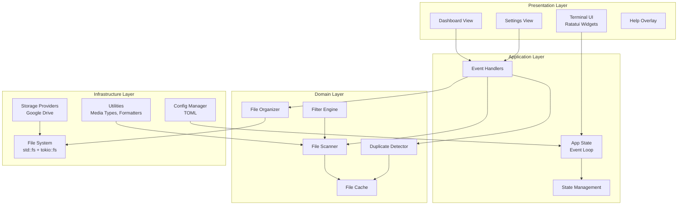
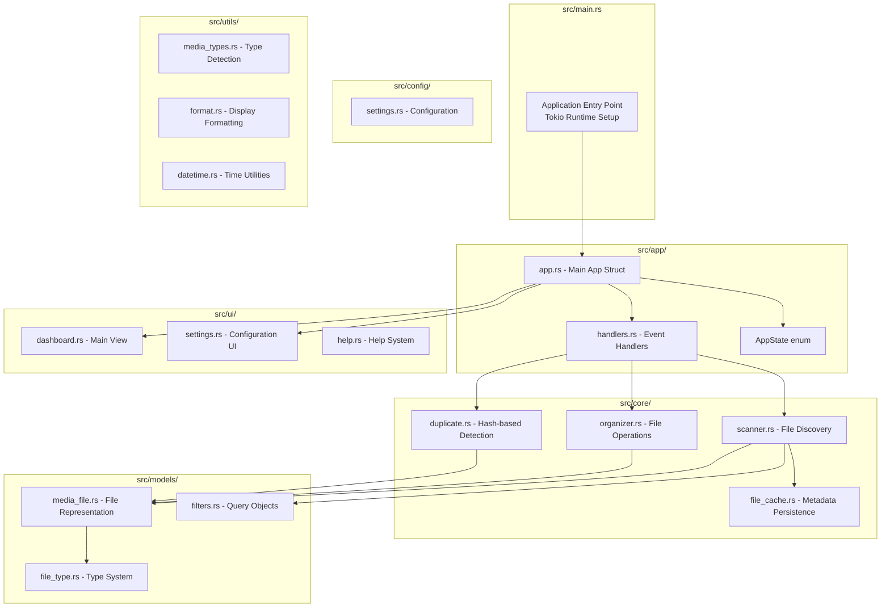
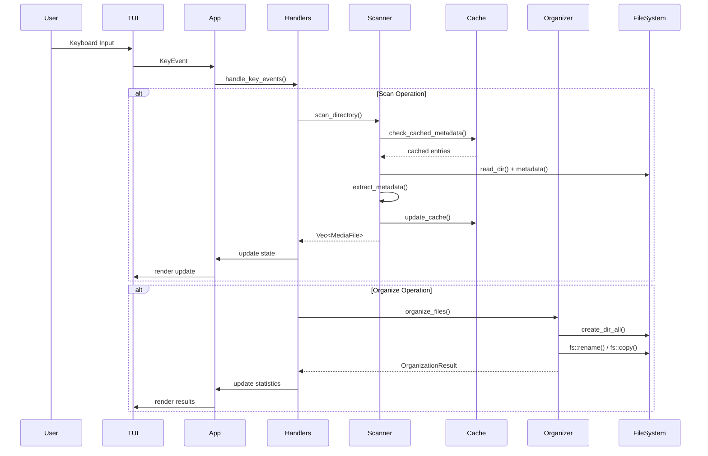
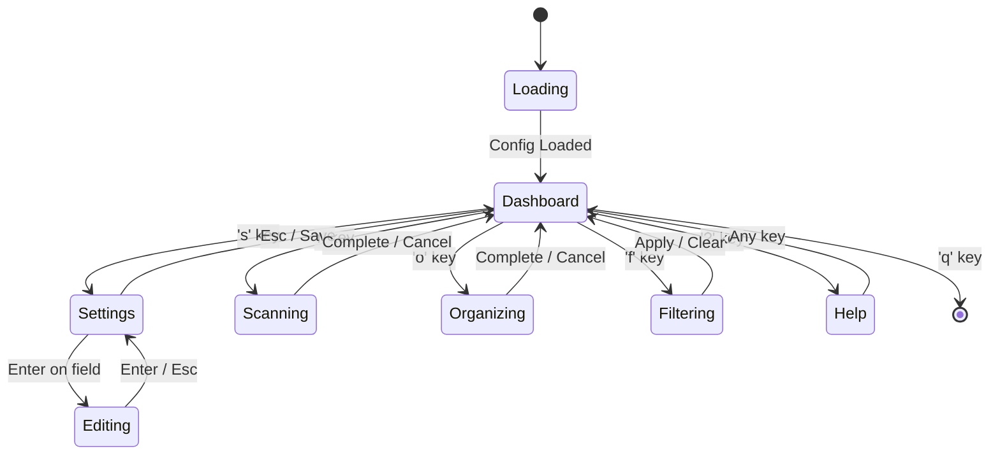
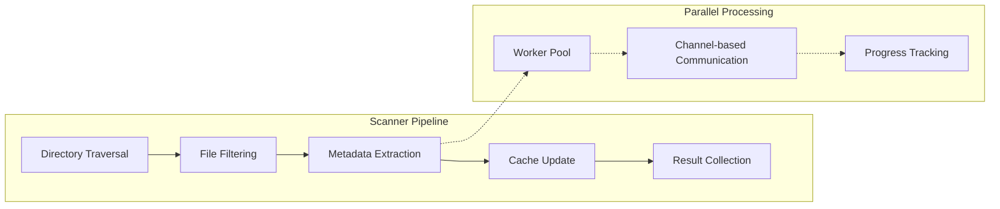
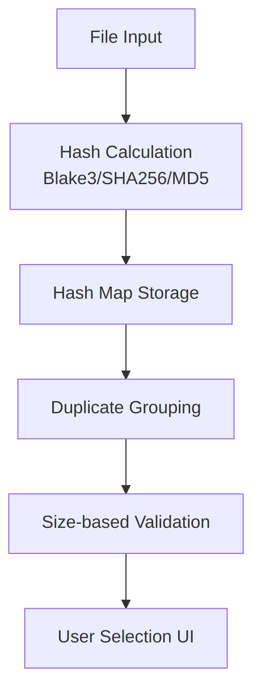
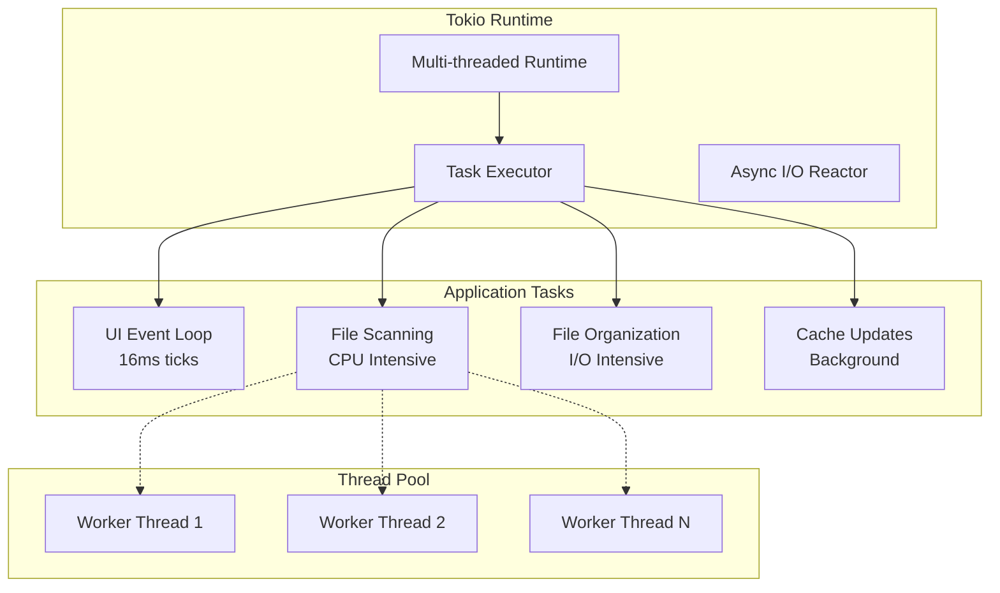
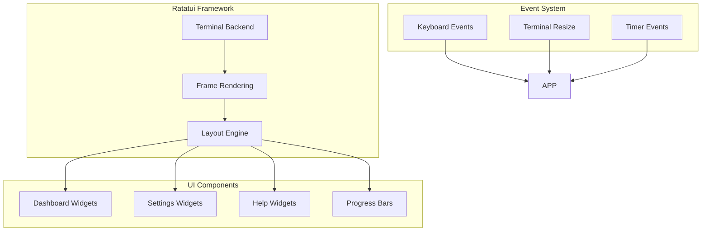

# 🖼️ VisualVault

A modern, terminal-based media file organizer built with Rust


[](https://codecov.io/gh/mikeleppane/visualvault)


## 🎥 Introduction Videos

[](https://youtu.be/JdzuCGQH1vQ)

<p align="center">
  <i>Click the image above to watch a quick introduction to VisualVault</i>
</p>


[](https://youtu.be/uvDJqplAudA)

<p align="center">
  <i>Click the image above to see VisualVault's Duplicate Detector in action</i>
</p>


[](https://youtu.be/iA52wnHlbxQ)

<p align="center">
  <i>Click the image above to see VisualVault's Undo/Redo operation in action</i>
</p>

## 📸 Screenshot

<p align="center">
  
</p>

## ✨ Features

### 🎯 Core Functionality

- **Smart Organization**: Automatically organize media files by date, type, or custom rules with multiple organization modes
- **Advanced Duplicate Detection**: Find and manage duplicate files with intelligent grouping and bulk cleanup operations
- **Metadata Extraction**: Extract comprehensive EXIF data from images for intelligent organization and insights
- **Batch Processing**: Handle thousands of files efficiently with async operations and configurable worker threads
- **Advanced Search**: Powerful search functionality with real-time filtering and partial matches
- **Smart Filtering System**: Multi-criteria filtering by date ranges, file sizes, media types, and regex patterns

### 🔍 Advanced Filtering & Search

- **Date Range Filters**: Filter by specific dates, ranges, or presets like "last 7 days", "today", "last month"
- **Size-Based Filtering**: Filter by file sizes with intuitive syntax (">10MB", "<1GB", "10MB-100MB")
- **Media Type Filtering**: Toggle different file types (images, videos, audio, documents, archives)
- **Regex Pattern Matching**: Advanced pattern matching on filenames, paths, or extensions
- **Multi-Filter Support**: Combine multiple filters of each type for complex queries
- **Real-Time Search**: Live search with instant results as you type

### 🔄 Duplicate Management

- **Intelligent Duplicate Detection**: Fast hash-based duplicate identification across your entire collection
- **Visual Group Management**: View duplicates organized in logical groups with file details
- **Selective Deletion**: Choose specific files to keep or delete from each duplicate group
- **Bulk Operations**: Delete all duplicates except originals with a single command
- **Space Analysis**: See potential space savings before cleanup operations
- **Safe Deletion**: Confirmation dialogs for destructive operations

### ↩️ Undo/Redo System

- **Comprehensive Operation Tracking**: All file operations are automatically recorded for undo capability
- **Multi-Level Undo**: Undo multiple operations in sequence with full operation history
- **Redo Support**: Re-apply undone operations with complete state restoration
- **Batch Operation Handling**: Undo entire organization runs as single operations
- **Persistent History**: Undo history survives application restarts
- **Global Shortcuts**: `Ctrl+Z` for undo and `Ctrl+R` for redo work from any screen

### 🖥️ Terminal User Interface

- **Modern TUI Design**: Beautiful terminal interface built with Ratatui featuring intuitive layouts
- **Multi-Tab Navigation**: Organized tabs for Files, Images, Videos, and Metadata views
- **Real-Time Progress Tracking**: Live progress bars and status updates for all operations
- **Interactive Dashboard**: Comprehensive statistics and insights about your media collection
- **Fully Keyboard-Driven**: Complete keyboard navigation with customizable shortcuts
- **Contextual Help System**: Scrollable help overlay with all keyboard shortcuts and usage tips
- **Visual Feedback**: Color-coded status messages, progress indicators, and focus highlighting

### ⚡ Performance & Efficiency

- **Async/Await Architecture**: Built on Tokio for blazing-fast concurrent operations
- **Configurable Worker Threads**: Adjust parallelism for optimal performance on your hardware  
- **Intelligent Caching**: Smart file metadata caching with automatic cleanup
- **Memory Optimization**: Efficient handling of large file collections
- **SSD-Optimized Operations**: Special settings and optimizations for solid-state drives
- **Background Processing**: Non-blocking operations that keep the UI responsive

### ⚙️ Configuration & Customization

- **Comprehensive Settings**: Detailed configuration options for all aspects of organization
- **Multiple Organization Modes**: Yearly, Monthly, Daily, By Type, or Type + Date structures
- **Flexible File Handling**: Options for duplicates, hidden files, metadata preservation
- **Performance Tuning**: Configurable buffer sizes, thread counts, and processing modes
- **Cross-Platform Config**: Automatic configuration management across Linux, macOS, and Windows
- **Live Settings Updates**: Changes take effect immediately without restart

### 📊 Analytics & Insights

- **Collection Statistics**: Detailed breakdowns of file types, sizes, and distribution
- **Duplicate Analysis**: Identify space waste and optimization opportunities
- **Metadata Insights**: View EXIF data, camera information, and technical details
- **Progress Monitoring**: Real-time feedback on scanning and organization operations
- **Storage Usage**: Track space utilization and potential savings

## 🚀 Getting Started

Prerequisites

- Rust 1.85 or higher
- Linux, macOS, or Windows

Installation

```bash
# Clone the repository
git clone https://github.com/mikeleppane/visualvault.git
cd visualvault

# Build the project
cargo build --release

# Run the application
cargo run --release
```

Quick Start

 1. Launch VisualVault:

```bash
cargo run --release
```

 2.Configure source and destination folders:
    - Press s to open Settings
    - Set your source folder (where your media files are)
    - Set your destination folder (where organized files will go)
 3. Start organizing:
    - Press r to scan for files

```bash

cargo run --release
```

 2.Configure source and destination folders:
    - Press s to open Settings
    - Set your source folder (where your media files are)
    - Set your destination folder (where organized files will go)
 3.Start organizing:
    - Press r to scan for files
    - Press o to organize them

## 🎮 Keyboard Shortcuts

Global

- `?` or `F1` - Show help
- `q` - Quit application
- `Tab` / `Shift+Tab` - Navigate between tabs
- `s` - Open settings
- `d` - Go to dashboard
Dashboard
- `r` - Start scanning
- `o` - Start organizing
- `f` - Search files
- `u` - update target/destination folder stats
Settings
- `↑`/`↓` - Navigate settings
- `Enter` - Edit setting
- `Space` - Toggle checkbox
- `S` - Save settings
- `R` - Reset to defaults

## 🛠️ Configuration

VisualVault stores its configuration in:

- macOS: ~/Library/Application Support/visualvault/config.toml
- Windows: %APPDATA%\visualvault\config.toml

Example Configuration

```toml
source_folder = "/home/mikko/dev/visualvault/testing"
destination_folder = "/home/mikko/dev/visualvault/testing/images"
recurse_subfolders = true
verbose_output = true
organize_by = "monthly"
separate_videos = false
dry_run = false
keep_original_structure = false
rename_duplicates = true
lowercase_extensions = true
preserve_metadata = true
create_thumbnails = false
worker_threads = 8
buffer_size = 8388608
enable_cache = true
parallel_processing = true
skip_hidden_files = false
optimize_for_ssd = false
```

## 📂 Organization Modes

- Yearly: 2024/image.jpg
- Monthly: 2024/03-March/image.jpg
- Daily: 2024/03/15/image.jpg
- By Type: Images/image.jpg
- Type + Date: Images/2024/03-March/image.jpg


## 🏗️ Architecture

VisualVault is built with a modular, async-first architecture that prioritizes performance, maintainability, and user experience.
The application follows a layered architecture with clear separation of concerns and leverages Rust's ownership model
for memory safety and performance.

### High-Level Architecture



### Component Architecture



### Data Flow Architecture



### State Management Pattern



### Core Components Deep Dive

#### 1. **Application State (src/app/app.rs)**

The main `App` struct serves as the central coordinator:

```rust
pub struct App {
    pub state: AppState,
    pub files: Vec<MediaFile>,
    pub settings_cache: Settings,
    pub selected_tab: usize,
    pub input_mode: InputMode,
    // ... other state fields
}

pub enum AppState {
    Dashboard,
    Settings,
    Help,
    Scanning,
    Organizing,
}
```

Key responsibilities:

- Maintains application state and UI state
- Coordinates between UI and business logic
- Manages configuration and settings
- Handles keyboard input routing

#### 2. **File Scanner (src/core/scanner.rs)**



Features:

- Async directory traversal with `walkdir`
- Parallel metadata extraction
- Smart caching with staleness detection
- Progress reporting via `Arc<RwLock<Progress>>`
- Support for different organization modes

#### 3. **File Organizer (src/core/organizer.rs)**

The organizer implements different strategies based on settings:

```rust
impl FileOrganizer {
    pub async fn organize_files(&self, files: Vec<MediaFile>, settings: &Settings) -> Result<OrganizationResult> {
        match settings.organize_by.as_str() {
            "yearly" => self.organize_by_date(files, DateFormat::Yearly).await,
            "monthly" => self.organize_by_date(files, DateFormat::Monthly).await,
            "type" => self.organize_by_type(files).await,
            _ => Err(Error::UnsupportedOrganizationMode),
        }
    }
}
```

#### 4. **Duplicate Detection (src/core/duplicate.rs)**

Uses hash-based detection with configurable algorithms:



#### 5. **Caching System (src/core/file_cache.rs)**

Persistent metadata cache using `serde` serialization:

```rust
#[derive(Serialize, Deserialize)]
pub struct FileCache {
    entries: HashMap<PathBuf, CacheEntry>,
    last_cleanup: SystemTime,
}

#[derive(Serialize, Deserialize)]
pub struct CacheEntry {
    metadata: MediaFileMetadata,
    last_modified: SystemTime,
    hash: Option<String>,
}
```

### Performance Architecture

#### Async Concurrency Model



Key performance features:

- **Non-blocking UI**: UI runs on separate task with 16ms refresh rate
- **Parallel File Processing**: Configurable worker thread pool
- **Streaming**: Large directories processed in chunks
- **Memory Management**: `Arc<T>` for shared data, bounded channels for backpressure

#### Memory Optimization Strategies

```rust
// Efficient string handling
pub struct MediaFile {
    pub path: PathBuf,           // Owned path
    pub name: String,            // Cached filename
    pub extension: String,       // Interned extension
    pub file_type: FileType,     // Enum (1 byte)
    pub size: u64,              // 8 bytes
    pub modified: DateTime<Local>, // 12 bytes
    pub hash: Option<String>,    // Lazy-computed
}
```

### Error Handling Architecture

Comprehensive error handling using `thiserror`:

```rust
#[derive(Debug, thiserror::Error)]
pub enum VisualVaultError {
    #[error("I/O error: {0}")]
    Io(#[from] std::io::Error),
    
    #[error("Configuration error: {message}")]
    Config { message: String },
    
    #[error("Scanner error: {0}")]
    Scanner(#[from] ScannerError),
    
    #[error("Organizer error: {0}")]
    Organizer(#[from] OrganizerError),
    
    #[error("Cache error: {0}")]
    Cache(#[from] CacheError),
}
```

### Configuration Management

TOML-based configuration with automatic migration:

```rust
#[derive(Debug, Clone, Serialize, Deserialize)]
pub struct Settings {
    pub source_folder: Option<PathBuf>,
    pub destination_folder: Option<PathBuf>,
    pub organize_by: String,
    pub parallel_processing: bool,
    pub worker_threads: usize,
    // ... other settings
}
```

Platform-specific config locations:

- Linux: `~/.config/visualvault/config.toml`
- macOS: `~/Library/Application Support/visualvault/config.toml`
- Windows: `%APPDATA%\visualvault\config.toml`

### UI Architecture (Ratatui-based)



### Testing Architecture

```rust
// Integration test structure
#[cfg(test)]
mod tests {
    use super::*;
    use tempfile::TempDir;
    
    async fn setup_test_env() -> (TempDir, Scanner, Settings) {
        // Test fixture setup
    }
    
    #[tokio::test]
    async fn test_complete_workflow() -> Result<()> {
        // End-to-end test
    }
}
```

Test categories:

- **Unit Tests**: Individual component testing
- **Integration Tests**: Complete workflow testing
- **Property Tests**: Fuzzing with `proptest`
- **Benchmark Tests**: Performance regression testing

### Security Considerations

- **Path Sanitization**: All paths are canonicalized to prevent traversal attacks
- **Permission Validation**: File operations check permissions before execution
- **Safe File Operations**: Atomic operations with rollback on failure
- **Input Validation**: All user input is validated and sanitized
- **No Unsafe Code**: Pure safe Rust implementation

### Extension Points and Plugin Architecture

The architecture supports extensions through:

1. **Custom Organization Strategies**: Implement `OrganizationStrategy` trait
2. **Storage Providers**: Implement `StorageProvider` trait for cloud backends
3. **Filter Types**: Add new filter implementations
4. **File Type Support**: Extend the `FileType` enum and detection logic

```rust
pub trait OrganizationStrategy: Send + Sync {
    async fn organize(&self, files: Vec<MediaFile>, settings: &Settings) -> Result<OrganizationResult>;
    fn name(&self) -> &'static str;
    fn description(&self) -> &'static str;
}
```

This architecture provides a solid foundation for the terminal-based media organizer while maintaining performance,
safety, and extensibility.


## 🤝 Contributing

Contributions are welcome! Please feel free to submit a Pull Request. For major changes, please open an issue first to
discuss what you would like to change.

### Quick Start for Contributors

```bash
# Fork and clone the repository
git clone https://github.com/yourusername/visualvault.git
cd visualvault

# Create a new branch
git checkout -b feature/your-feature-name

# Make your changes and run tests
cargo test
cargo clippy -- -D warnings
cargo fmt

# Commit and push
git commit -m "feat: add amazing feature"
git push origin feature/your-feature-name
```

See [CONTRIBUTING.md](CONTRIBUTING.md) for the full guide.

### Development Setup

### 🧪 Testing

VisualVault has a comprehensive test suite to ensure reliability and correctness. We use both standard Rust tests and
[cargo-nextest](https://nexte.st/) for improved test execution.

#### Running Tests

```bash
# Run all tests
cargo test

# Run tests with output
cargo test -- --nocapture

# Run tests for a specific module
cargo test core::scanner::tests

# Run only unit tests
cargo test --lib

# Run only integration tests
cargo test --test '*'

# Run tests with nextest (faster, better output)
cargo nextest run

# Run tests in CI mode
cargo nextest run --profile ci
```

#### Test Coverage

The project includes extensive test coverage for all major components:

- **Scanner**: File discovery, metadata extraction, hidden file handling
- **Organizer**: File organization logic, duplicate handling, naming conflicts
- **Duplicate Detector**: Hash calculation, duplicate identification, cleanup operations
- **File Cache**: Persistence, validation, stale entry cleanup
- **Filters**: Date range parsing, size filtering, media type detection
- **Utils**: Byte formatting, datetime conversion, media type determination

#### Integration Tests

Integration tests verify the complete workflow:

```bash
# Run integration tests only
cargo test --test integration

# Run specific integration test
cargo test --test integration scanner_finds_all_media_files
```

#### Test Configuration

For optimal test performance with nextest, create `.config/nextest.toml`:

```toml
[profile.default]
failure-output = "immediate-final"
fail-fast = false

[profile.ci]
reporter = "junit"
retries = 0
fail-fast = true
```

#### Writing Tests

When contributing, please ensure:

- All new features have corresponding unit tests
- Integration tests cover major workflows
- Tests use descriptive names following Rust conventions
- Use test fixtures and helper functions to reduce duplication

Example test structure:

```rust
#[cfg(test)]
mod tests {
    use super::*;
    use tempfile::TempDir;

    #[tokio::test]
    async fn test_scanner_finds_media_files() -> Result<()> {
        let temp_dir = TempDir::new()?;
        // Test implementation
        Ok(())
    }
}
```

#### Continuous Integration

Tests run automatically on all pull requests via GitHub Actions:

- ✅ Unit and integration tests on Linux, macOS, and Windows
- ✅ Clippy linting with strict warnings
- ✅ Format checking with rustfmt
- ✅ Cross-platform build verification

### 🚀 Performance Benchmarks

VisualVault includes comprehensive performance benchmarks to ensure optimal performance across different workloads and
system configurations.

#### Running Benchmarks

```bash
# Run all benchmarks
cargo bench

# Run specific benchmark suite
cargo bench --bench scanner_benchmark
cargo bench --bench organizer_benchmark
cargo bench --bench duplicate_benchmark
cargo bench --bench cache_benchmark

# Run benchmarks and save baseline
cargo bench -- --save-baseline my-baseline

# Compare against baseline
cargo bench -- --baseline my-baseline

# Generate HTML report
cargo bench
# Open target/criterion/report/index.html in your browser
```

#### Benchmark Suites

**Scanner Performance** (`scanner_benchmark`)

- Tests file discovery performance with varying file counts (100, 1000, 5000 files)
- Measures parallel processing efficiency with different thread counts
- Benchmarks metadata extraction and caching performance

**Organizer Performance** (`organizer_benchmark`)

- Benchmarks different organization modes (yearly, monthly, by type)
- Tests file movement operations with various file counts
- Measures duplicate handling performance

**Duplicate Detection** (`duplicate_benchmark`)

- Tests hash calculation speed with different algorithms
- Benchmarks duplicate identification with varying duplicate ratios
- Measures performance with different collection sizes

**Cache Operations** (`cache_benchmark`)

- Benchmarks cache read/write performance
- Tests cache cleanup and stale entry removal
- Measures serialization/deserialization overhead

#### Performance Metrics

Our benchmarks track key performance indicators:

| Operation | Files | Time | Throughput |
|-----------|-------|------|------------|
| Scan Directory | 1,000 | ~50ms | 20,000 files/sec |
| Scan Directory | 5,000 | ~200ms | 25,000 files/sec |
| Organize (by type) | 1,000 | ~100ms | 10,000 files/sec |
| Duplicate Detection | 1,000 | ~30ms | 33,000 files/sec |
| Cache Write | 1,000 | ~20ms | 50,000 entries/sec |

**Note:** *Performance varies based on hardware, file system, and system load*


#### Continuous Performance Monitoring

Performance is continuously monitored through GitHub Actions:

- Benchmarks run automatically on pull requests
- Performance regressions are flagged if they exceed 200% threshold
- Historical performance data is tracked for trend analysis
- Benchmark results are posted as PR comments for easy review

#### Writing Benchmarks

When contributing performance-critical code, please add corresponding benchmarks:

```rust
use criterion::{black_box, criterion_group, criterion_main, Criterion};

fn benchmark_my_function(c: &mut Criterion) {
    c.bench_function("my_function", |b| {
        b.iter(|| {
            my_function(black_box(input))
        });
    });
}

criterion_group!(benches, benchmark_my_function);
criterion_main!(benches);
```

#### Performance Best Practices

When optimizing for performance:

1. **Profile First**: Use benchmarks to identify bottlenecks
2. **Measure Impact**: Verify improvements with benchmarks
3. **Consider Trade-offs**: Balance performance with code clarity
4. **Document Changes**: Explain performance optimizations in comments
5. **Test Edge Cases**: Benchmark with different data sizes and patterns

#### Hardware Considerations

Benchmarks are optimized for different hardware configurations:

- **SSD Optimization**: Enable `optimize_for_ssd` setting for better SSD performance
- **Thread Scaling**: Adjust `worker_threads` based on CPU cores
- **Memory Usage**: Configure `buffer_size` based on available RAM
- **I/O Patterns**: Benchmarks test both sequential and random access patterns


## 📝 Roadmap

- <input disabled="" type="checkbox"> Add video metadata extraction
- <input disabled="" type="checkbox"> Add export/import functionality
- <input disabled="" type="checkbox"> Cloud storage integration

## 🤝 Community

[](CODE_OF_CONDUCT.md)

We have a [Code of Conduct](CODE_OF_CONDUCT.md) that all contributors and participants are expected to follow.


## 📄 License

This project is licensed under the MIT License - see the [LICENSE file](LICENSE.md) for details.

## 🙏 Acknowledgments

- built with Ratatui - Terminal UI framework
- Uses Tokio - Async runtime for Rust
- walkdir - Recursive directory traversal
- kamadak-exif - EXIF metadata extraction

<p align="center"> Written with ❤️ in Rust & built with Ratatui </p>
