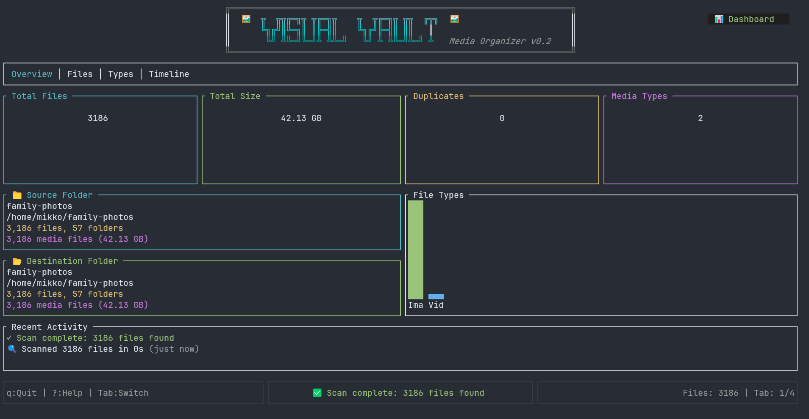

# 🖼️ VisualVault
A modern, terminal-based media file organizer built with Rust


## 🎥 Introduction Videos

[](https://youtu.be/JdzuCGQH1vQ)

<p align="center">
  <i>Click the image above to watch a quick introduction to VisualVault</i>
</p>


[](https://youtu.be/uvDJqplAudA)

<p align="center">
  <i>Click the image above to see VisualVault's Duplicate Detector in action</i>
</p>

## 📸 Screenshot

<p align="center">
  
</p>

## ✨ Features

### 🎯 Core Functionality
- **Smart Organization**: Automatically organize media files by date, type, or custom rules with multiple organization modes
- **Advanced Duplicate Detection**: Find and manage duplicate files with intelligent grouping and bulk cleanup operations
- **Metadata Extraction**: Extract comprehensive EXIF data from images for intelligent organization and insights
- **Batch Processing**: Handle thousands of files efficiently with async operations and configurable worker threads
- **Advanced Search**: Powerful search functionality with real-time filtering and partial matches
- **Smart Filtering System**: Multi-criteria filtering by date ranges, file sizes, media types, and regex patterns

### 🔍 Advanced Filtering & Search
- **Date Range Filters**: Filter by specific dates, ranges, or presets like "last 7 days", "today", "last month"
- **Size-Based Filtering**: Filter by file sizes with intuitive syntax (">10MB", "<1GB", "10MB-100MB")
- **Media Type Filtering**: Toggle different file types (images, videos, audio, documents, archives)
- **Regex Pattern Matching**: Advanced pattern matching on filenames, paths, or extensions
- **Multi-Filter Support**: Combine multiple filters of each type for complex queries
- **Real-Time Search**: Live search with instant results as you type

### 🔄 Duplicate Management
- **Intelligent Duplicate Detection**: Fast hash-based duplicate identification across your entire collection
- **Visual Group Management**: View duplicates organized in logical groups with file details
- **Selective Deletion**: Choose specific files to keep or delete from each duplicate group
- **Bulk Operations**: Delete all duplicates except originals with a single command
- **Space Analysis**: See potential space savings before cleanup operations
- **Safe Deletion**: Confirmation dialogs for destructive operations

### 🖥️ Terminal User Interface
- **Modern TUI Design**: Beautiful terminal interface built with Ratatui featuring intuitive layouts
- **Multi-Tab Navigation**: Organized tabs for Files, Images, Videos, and Metadata views
- **Real-Time Progress Tracking**: Live progress bars and status updates for all operations
- **Interactive Dashboard**: Comprehensive statistics and insights about your media collection
- **Fully Keyboard-Driven**: Complete keyboard navigation with customizable shortcuts
- **Contextual Help System**: Scrollable help overlay with all keyboard shortcuts and usage tips
- **Visual Feedback**: Color-coded status messages, progress indicators, and focus highlighting

### ⚡ Performance & Efficiency
- **Async/Await Architecture**: Built on Tokio for blazing-fast concurrent operations
- **Configurable Worker Threads**: Adjust parallelism for optimal performance on your hardware  
- **Intelligent Caching**: Smart file metadata caching with automatic cleanup
- **Memory Optimization**: Efficient handling of large file collections
- **SSD-Optimized Operations**: Special settings and optimizations for solid-state drives
- **Background Processing**: Non-blocking operations that keep the UI responsive

### ⚙️ Configuration & Customization
- **Comprehensive Settings**: Detailed configuration options for all aspects of organization
- **Multiple Organization Modes**: Yearly, Monthly, Daily, By Type, or Type + Date structures
- **Flexible File Handling**: Options for duplicates, hidden files, metadata preservation
- **Performance Tuning**: Configurable buffer sizes, thread counts, and processing modes
- **Cross-Platform Config**: Automatic configuration management across Linux, macOS, and Windows
- **Live Settings Updates**: Changes take effect immediately without restart

### 📊 Analytics & Insights  
- **Collection Statistics**: Detailed breakdowns of file types, sizes, and distribution
- **Duplicate Analysis**: Identify space waste and optimization opportunities
- **Metadata Insights**: View EXIF data, camera information, and technical details
- **Progress Monitoring**: Real-time feedback on scanning and organization operations
- **Storage Usage**: Track space utilization and potential savings

## 🚀 Getting Started
Prerequisites
 * Rust 1.75 or higher
 * Linux, macOS, or Windows

Installation

```bash
# Clone the repository
git clone https://github.com/yourusername/visualvault.git
cd visualvault

# Build the project
cargo build --release

# Run the application
cargo run --release
```

Quick Start
 1. Launch VisualVault:
```bash
cargo run --release
```

 2. Configure source and destination folders:
    * Press s to open Settings
    * Set your source folder (where your media files are)
    * Set your destination folder (where organized files will go)
 3. Start organizing:
    * Press r to scan for files
    * Press o to organize them

## 🎮 Keyboard Shortcuts
Global
 * `?` or `F1` - Show help
 * `q` - Quit application
 * `Tab` / `Shift+Tab` - Navigate between tabs
 * `s` - Open settings
 * `d` - Go to dashboard
Dashboard
 * `r` - Start scanning
 * `o` - Start organizing
 * `f` - Search files
 * `u` - update target/destination folder stats
Settings
 * `↑`/`↓` - Navigate settings
 * `Enter` - Edit setting
 * `Space` - Toggle checkbox
 * `S` - Save settings
 * `R` - Reset to defaults

## 🛠️ Configuration
VisualVault stores its configuration in:

 * Linux: ~/.config/visualvault/config.toml
 * macOS: ~/Library/Application Support/visualvault/config.toml
 * Windows: %APPDATA%\visualvault\config.toml
Example Configuration
```toml
source_folder = "/home/mikko/dev/visualvault/testing"
destination_folder = "/home/mikko/dev/visualvault/testing/images"
recurse_subfolders = true
verbose_output = true
organize_by = "monthly"
separate_videos = false
dry_run = false
keep_original_structure = false
rename_duplicates = true
lowercase_extensions = true
preserve_metadata = true
create_thumbnails = false
worker_threads = 8
buffer_size = 8388608
enable_cache = true
parallel_processing = true
skip_hidden_files = false
optimize_for_ssd = false
```
## 📂 Organization Modes
 * Yearly: 2024/image.jpg
 * Monthly: 2024/03-March/image.jpg
 * Daily: 2024/03/15/image.jpg
 * By Type: Images/image.jpg
 * Type + Date: Images/2024/03-March/image.jpg
##  🤝 Contributing
Contributions are welcome! Please feel free to submit a Pull Request. For major changes, please open an issue first to discuss what you would like to change.

### Development Setup

### 🧪 Testing

VisualVault has a comprehensive test suite to ensure reliability and correctness. We use both standard Rust tests and [cargo-nextest](https://nexte.st/) for improved test execution.

#### Running Tests

```bash
# Run all tests
cargo test

# Run tests with output
cargo test -- --nocapture

# Run tests for a specific module
cargo test core::scanner::tests

# Run only unit tests
cargo test --lib

# Run only integration tests
cargo test --test '*'

# Run tests with nextest (faster, better output)
cargo nextest run

# Run tests in CI mode
cargo nextest run --profile ci
```

#### Test Coverage

The project includes extensive test coverage for all major components:

- **Scanner**: File discovery, metadata extraction, hidden file handling
- **Organizer**: File organization logic, duplicate handling, naming conflicts
- **Duplicate Detector**: Hash calculation, duplicate identification, cleanup operations
- **File Cache**: Persistence, validation, stale entry cleanup
- **Filters**: Date range parsing, size filtering, media type detection
- **Utils**: Byte formatting, datetime conversion, media type determination

#### Integration Tests

Integration tests verify the complete workflow:

```bash
# Run integration tests only
cargo test --test integration

# Run specific integration test
cargo test --test integration scanner_finds_all_media_files
```

#### Test Configuration

For optimal test performance with nextest, create `.config/nextest.toml`:

```toml
[profile.default]
failure-output = "immediate-final"
fail-fast = false

[profile.ci]
reporter = "junit"
retries = 0
fail-fast = true
```

#### Writing Tests

When contributing, please ensure:
- All new features have corresponding unit tests
- Integration tests cover major workflows
- Tests use descriptive names following Rust conventions
- Use test fixtures and helper functions to reduce duplication

Example test structure:
```rust
#[cfg(test)]
mod tests {
    use super::*;
    use tempfile::TempDir;

    #[tokio::test]
    async fn test_scanner_finds_media_files() -> Result<()> {
        let temp_dir = TempDir::new()?;
        // Test implementation
        Ok(())
    }
}
```

#### Continuous Integration

Tests run automatically on all pull requests via GitHub Actions:
- ✅ Unit and integration tests on Linux, macOS, and Windows
- ✅ Clippy linting with strict warnings
- ✅ Format checking with rustfmt
- ✅ Cross-platform build verification

#### Performance Testing

For performance-critical code, we include benchmarks:

```bash
# Run benchmarks (requires nightly Rust)
cargo +nightly bench

# Benchmark specific component
cargo +nightly bench scanner
```

## 📝 Roadmap
 * <input disabled="" type="checkbox"> Add video metadata extraction
 * <input disabled="" type="checkbox"> Add export/import functionality
 * <input disabled="" type="checkbox"> Cloud storage integration

## 📄 License
This project is licensed under the MIT License - see the LICENSE file for details.

## 🙏 Acknowledgments
 * built with Ratatui - Terminal UI framework
 * Uses Tokio - Async runtime for Rust
 * walkdir - Recursive directory traversal
 * kamadak-exif - EXIF metadata extraction
<p align="center"> Written with ❤️ in Rust & built with Ratatui </p>